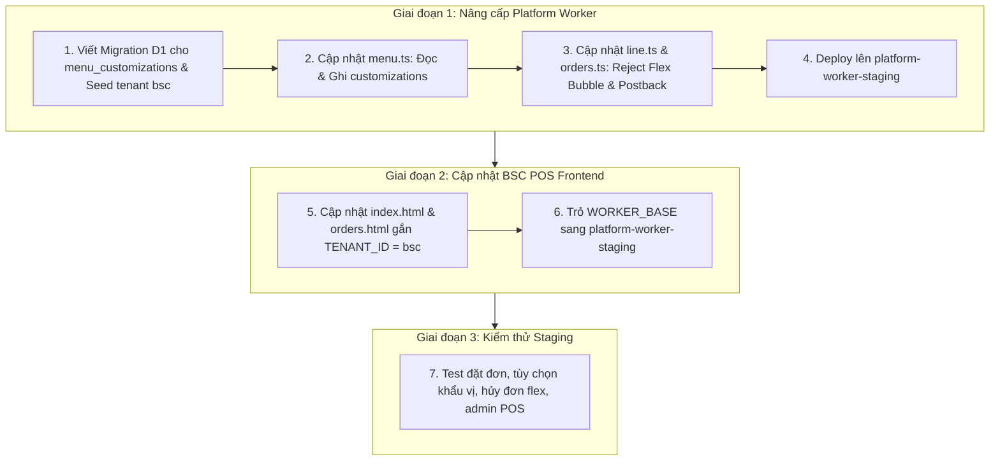

# Báo Cáo Đánh Giá & Kế Hoạch Chuyển Đổi: BSC Worker ➔ Platform Worker

> **Ngày cập nhật:** 16/08/2026  
> **Mục tiêu:** Chuyển đổi hệ thống backend của quán BSC (干城鹹水雞) sang dùng chung **Platform Worker** đa người thuê (hiện tại là `benmi-worker-official`), đồng thời kết nối frontend [index.html](file:///Users/duccao/Documents/bsc-pos/index.html) và [orders.html](file:///Users/duccao/Documents/bsc-pos/orders.html) sang **Staging Platform Worker** để kiểm thử.

---

## 1. Tổng Quan Đánh Giá

| Tiêu chí | Trạng thái | Chi tiết |
| :--- | :---: | :--- |
| **Tính khả thi** | 🟢 **100% Khả thi** | Platform Worker đã có sẵn kiến trúc Multi-Tenant phân lập dữ liệu chuẩn xác. |
| **Khối lượng công việc** | 🟡 **Gọn gàng & Rõ ràng** | Chỉ cần bổ sung 2 module đặc thù (`menu_customizations` và `Reject Flex Postback`) vào Platform, sau đó gắn `tenant_id: "bsc"` trên frontend BSC POS. |
| **Rủi ro ảnh hưởng Benmi** | 🟢 **Bằng 0** | Mọi dữ liệu và cấu hình đều được phân tách tuyệt đối theo `tenant_id`. |

---

## 2. Bảng So Sánh & Thống Nhất Thiết Kế

| Phân hệ / Nghiệp vụ | Trạng thái thiết kế | Hướng xử lý khi gộp vào Platform |
| :--- | :---: | :--- |
| **Nhóm tùy chọn món (`customizations`)** | ⚠️ Cần bổ sung | Platform cần hỗ trợ đọc/ghi bảng `menu_customizations` (Khẩu vị, Độ cay, Độ mặn, Topping). |
| **Từ chối đơn hàng (`REJECTED`)** | ⚠️ Cần bổ sung | Platform cần bổ sung **Reject Flex Message** kèm 2 nút tương tác Postback (`🔴 同意取消訂單` / `⚪ 不同意`). |
| **Thông báo khi nhận đơn (`ACCEPTED`)** | ✅ Đã thống nhất bỏ | Không push notification khi nhân viên bấm nhận đơn. |
| **Thông báo khi làm xong (`DONE`)** | ✅ Đã thống nhất bỏ | Không push notification khi nhân viên bấm làm xong. |
| **API `GET /api/pending-actions`** | ✅ Đã thống nhất bỏ | Không dùng API này; toàn bộ tương tác hủy/đổi món diễn ra trực tiếp qua tin nhắn bot LINE. |
| **Tự động dọn đơn treo sau 15 phút** | ✅ Đã thống nhất bỏ | Không chạy ngầm hàm dọn đơn tự động. |
| **Cơ chế Đóng/Mở quán & Link tạm & Ảnh** | ✅ Đã sẵn sàng | Sử dụng trực tiếp hạ tầng Multi-Tenant có sẵn của Platform Worker. |

---

## 3. PHẦN A: Các Hạng Mục Cần Sửa & Lưu Ý Phía PLATFORM WORKER (`benmi-worker-official`)

### 3.1. Hạng mục cần SỬA CODE

1. **Bổ sung Quản lý `menu_customizations` (`src/modules/menu.ts`):**
   - **`getMenu`:** Sau khi lấy categories và items, thực hiện truy vấn thêm bảng `menu_customizations WHERE tenant_id = ? ORDER BY sort_order ASC`. Nếu có dữ liệu, gắn mảng `customizations` vào JSON trả về để frontend BSC POS render bộ chọn Vị / Cay / Mặn.
   - **`updateMenu`:** Khi nhận payload chứa mảng `customizations`, thực hiện cập nhật (UPSERT / DELETE) vào bảng `menu_customizations` theo `tenant_id`.

2. **Bổ sung Reject Flex Message & Postback Handling (`src/modules/line.ts` & `src/modules/orders.ts`):**
   - **Tạo Flex Bubble:** Thêm hàm `createRejectFlexBubble(orderKey, reason)` vào `src/modules/line.ts` (màu đỏ `#DC2626`, hiển thị mã đơn, lý do từ chối và 2 nút postback `🔴 同意取消訂單` / `⚪ 不同意`).
   - **Gửi Flex khi Từ chối (`updateOrder`):** Khi `incoming === "REJECTED"`, gửi Reject Flex Message cho khách hàng qua LINE.
   - **Xử lý Postback trong LINE Webhook (`handleLineWebhook`):**
     - Bắt sự kiện Postback với `action=reject_agree`: Cập nhật trạng thái đơn trong D1 thành `REJECTED`, xóa pending_actions, đồng bộ Google Sheets, và gửi tin nhắn cảm ơn / xác nhận hủy đơn.
     - Bắt sự kiện Postback với `action=reject_disagree`: Cập nhật trạng thái đơn về lại `NEW` để nhân viên xem xét lại.

3. **Tạo File Migration D1:**
   - Tạo file `migrations/0010_add_menu_customizations_and_seed_bsc.sql` gồm:
     - Tạo bảng `menu_customizations` (nếu chưa có).
     - Thêm bản ghi tenant `'bsc'` vào bảng `tenants`.
     - Thêm bản ghi cấu hình tenant `'bsc'` vào bảng `tenant_config`.

---

### 3.2. Các LƯU Ý Phía Platform Worker

> [!IMPORTANT]
> 1. **LINE Webhook Routing:**  
>    LINE Bot của BSC phải được cấu hình Webhook URL trỏ tới:  
>    `https://<platform-worker-domain>/webhook/bsc`  
>    *(Platform Worker đã có cơ chế tự động bóc tách `/webhook/:tenantId` để nạp đúng TenantContext của quán BSC).*
>
> 2. **Cấu hình Secrets & Biến Môi trường:**  
>    - `tenant_config` của BSC trên D1 cần chứa `line_channel_token`, `liff_id`, `liff_url`, `brand_name: "干城鹹水雞"`, `store_address`, `operating_hours`.
>    - Nếu `line_channel_token` để trống trong D1, Worker sẽ fallback lấy secret binding trong `wrangler.jsonc`.

---

## 4. PHẦN B: Các Hạng Mục Cần Sửa & Lưu Ý Phía BSC-POS FRONTEND (`bsc-pos`)

### 4.1. Hạng mục cần SỬA CODE

1. **Khai báo Hằng số `TENANT_ID` và Đổi `WORKER_BASE` sang Staging:**
   - Trong cả [index.html](file:///Users/duccao/Documents/bsc-pos/index.html) và [orders.html](file:///Users/duccao/Documents/bsc-pos/orders.html):
   ```javascript
   // Cấu hình kết nối Staging Platform Worker
   const WORKER_BASE = "https://platform-worker-staging.thuanmnc.workers.dev";
   const TENANT_ID = "bsc";
   ```

2. **Gắn `TENANT_ID` vào toàn bộ các lời gọi API (`fetch`):**
   - **Gắn qua Header:** `headers: { 'Content-Type': 'application/json', 'X-Tenant-ID': TENANT_ID }`
   - **Gắn qua Query Param:** Bổ sung `tenant_id=${TENANT_ID}` vào các URL GET/DELETE (ví dụ: `/api/menu?tenant_id=bsc`, `/api/orders?tenant_id=bsc`, `/api/config?tenant_id=bsc`, `/api/image_list?tenant_id=bsc`, `/api/image?name=...&tenant_id=bsc`, `/api/orders/waiting-count?tenant_id=bsc`, `/api/orders/history-summary?tenant_id=bsc`, `/api/orders/by-date?date=...&tenant_id=bsc`, `/api/orders/history-all?tenant_id=bsc`).

3. **Dọn dẹp code thừa trên [index.html](file:///Users/duccao/Documents/bsc-pos/index.html):**
   - Xóa bỏ hoặc vô hiệu hóa hàm `checkPendingActions()` và `resolvePendingAction()` (do không còn dùng API `GET /api/pending-actions`).

---

### 4.2. Các LƯU Ý Phía BSC-POS Frontend

> [!TIP]
> 1. **Kiểm tra Header CORS:**  
>    Platform Worker đã mở `Access-Control-Allow-Headers: Content-Type, Authorization, X-Tenant-ID`, cho phép frontend gửi header `X-Tenant-ID` thoải mái từ trình duyệt mà không bị chặn CORS.
>
> 2. **Phân lập Dữ liệu Hình ảnh:**  
>    Ảnh món ăn của BSC sẽ được lưu trong KV với prefix `tenant:bsc:image:...`, hoàn toàn độc lập với Benmi (`tenant:benmi:image:...`).
>
> 3. **Phân lập Mật khẩu Quản trị (PIN):**  
>    Trang [orders.html](file:///Users/duccao/Documents/bsc-pos/orders.html) của BSC dùng mật khẩu riêng được lưu trong `tenant:bsc:password` (mặc định khởi tạo từ `tenant_config.default_password` là `12345678`).

---

## 5. Kế Hoạch Triển Khai Từng Bước & Checklist Kiểm Thử Staging



### Checklist Kiểm Thử Trên Môi Trường Staging
- [ ] **1. Tải Thực Đơn ([index.html](file:///Users/duccao/Documents/bsc-pos/index.html)):**
  - Hiển thị đầy đủ danh mục món ăn BSC.
  - Hiển thị đầy đủ 4 nhóm tùy chọn: ✦ 口味選擇 (Khẩu vị), ✦ 鹹度調整 (Độ mặn), ✦ 辣度選擇 (Độ cay), ✦ 配料調整 (Gia vị kèm).
- [ ] **2. Đặt Đơn Hàng Mới:**
  - Khách chọn món + tùy biến vị ➔ Bấm gửi đơn.
  - Đơn lưu thành công vào D1 với `tenant_id = 'bsc'`.
- [ ] **3. Trang Quản Trị Đơn Hàng ([orders.html](file:///Users/duccao/Documents/bsc-pos/orders.html)):**
  - Đăng nhập mật khẩu PIN của BSC thành công.
  - Danh sách đơn hàng hiển thị đúng các đơn của `bsc` (không bị lẫn đơn của `benmi`).
  - Thao tác chuyển trạng thái: `ACCEPTED`, `DONE`, `PICKED_UP` hoạt động trơn tru (không gửi tin nhắn push theo đúng thiết kế).
- [ ] **4. Từ Chối / Hủy Đơn Hàng:**
  - Nhân viên bấm Hủy đơn (REJECTED) ➔ LINE Bot gửi Reject Flex Bubble cho khách kèm 2 nút bấm.
  - Khách bấm `🔴 同意取消訂單` ➔ Đơn chuyển sang `REJECTED`, dọn pending_actions, bot gửi tin nhắn xác nhận.
  - Khách bấm `⚪ 不同意` ➔ Đơn quay lại `NEW`.
- [ ] **5. Đóng / Mở Quán & Quản Lý:**
  - Bật/Tắt trạng thái nhận đơn trên [orders.html](file:///Users/duccao/Documents/bsc-pos/orders.html) ➔ [index.html](file:///Users/duccao/Documents/bsc-pos/index.html) nhận diện chính xác trạng thái của BSC.
